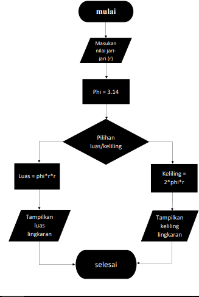
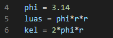
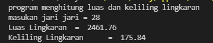
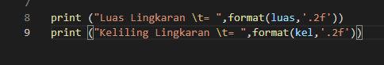

# project-python
## tugas

## flow chart

untuk menentukan langkah-langkah luas dan keliling lingkaran sebagai berikut

# Menghitung luas dan keliling 
## code untuk menghitung 

    print("program menghitung luas dan keliling lingkaran")
    r = int(input("masukan jari jari = "))

    phi = 3.14
    luas = phi*r*r
    kel = 2*phi*r

    print ("Luas Lingkaran \t= ",format(luas,'.2f'))
    print ("Keliling Lingkaran \t= ",format(kel,'.2f'))

## rumus menghitung
Berikut cara menghitung luas dan keliling lingkaran

    nilai phi yang digunakan adalah 14 
    dan r adalah jari jari lingkaran

## Output
contoh output  bila dimasukan jari-jari dengan nilai 28

## Penjelasan 
untuk mengambil 2 angka pecahan saja kita pakai fungsi format '.2f' seperti berikut:

dengan rumus seperti diatas dapat mengambil kesimpulan 2 angka dibelakang titik
